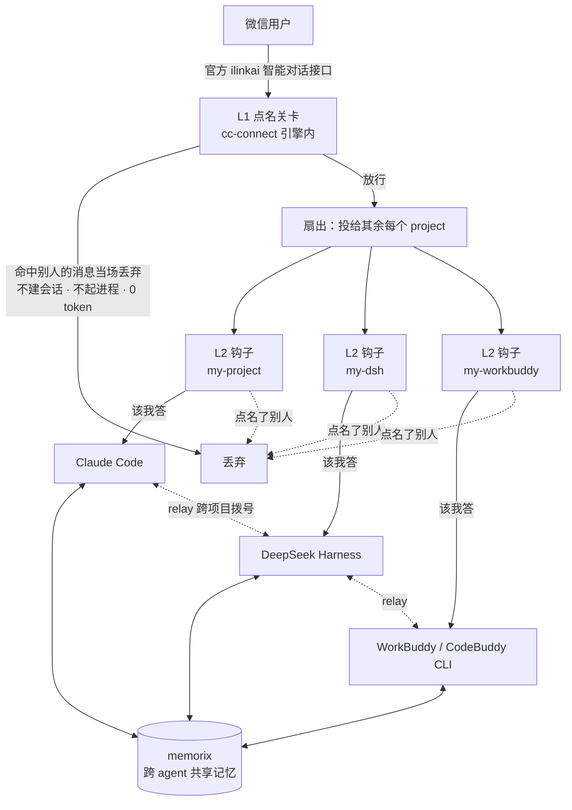

# cc-connect-multi-agent

把**多个不同的 AI agent** 接到**同一个微信入口**的完整实践记录 —— 含架构、配置、探针脚本、
一套**引擎层点名路由** + 一套**三平台通用的前置拦截钩子**、以及一路踩过的坑。

> 这套东西跑在一台 Windows 11 笔记本上（Ryzen 7 6800H + RTX 3050 Ti）。目标很朴素：**不想为了跟不同 AI 说话而开不同的窗口**，就用微信当一个统一入口，背后挂三个 agent，各干各擅长的活。
>
> 三个 agent 共用一个微信入口，所以「一条消息其实三个人都收到」是**原生行为**。
> 解决的路线是把判定**一路前移**，前后共三层（见 `docs/07`）：
> **L1** 在**进入 agent 之前**（引擎层点名关卡，`patches/0007`）→
> **L2** 在**调用模型之前**（agent 侧钩子，`hooks/`）→
> **L3** 在**模型跑完之后**（提示词层的 `NO_REPLY` 兜底）。
> 否则每跟一个 agent 说话，另外两个也要各烧一次完整 LLM 调用。

---

## 架构



- **入口层**：微信（走腾讯官方 ilinkai 智能对话接口，非第三方协议，无封号风险）
- **桥接层**：`cc-connect` —— 负责收消息、拉起 agent、把回复发回去
- **L1 点名关卡层**：cc-connect **引擎内**（需打 `patches/0007`–`0011`）—— 读消息**句首那一串** `@`
  记号（一条消息点名几个，几个就都放行）；命中别人就在**建会话之前**丢弃，是最省的一层
- **L2 前置拦截层**：三家各自的 `UserPromptSubmit` 钩子 —— 在模型被调用之前判定这条是不是给自己的
- **L3 输出静默层**：提示词约定（`NO_REPLY`）—— 前两层看不见的消息（斜杠命令、别名盲区）靠它兜底
- **agent 层**：Claude Code（原生支持）、DSH / WorkBuddy（都走标准 ACP 协议）
- **协作层**：`relay`（agent 之间互相拨号）+ `memorix`（共享记忆与留言板）

> 三层的分工、边界与「为什么不能去掉任何一层」，见 `docs/07-点名路由与三层防线-落地报告.md`。

---

## memorix（跨 agent 共享记忆层）—— **本项目依赖它才能闭环**

架构图里那个 `M` 就是 [memorix](https://github.com/AVIDS2/memorix)：一个**本地优先**的
跨 agent 共享记忆 / 协调层。它**不是可选装饰** —— 本方案里「agent 之间能互相留话、
能知道谁被点名了」这件事全建立在它上面。

### 它在这里承担三件事

| 用途 | 说明 |
|---|---|
| **共享记忆** | 三个 agent 共用一份长期记忆（决策、约定、踩过的坑），换个 agent 接着干不用重讲一遍 |
| **留言板 / 收件箱** | agent 之间、人和 agent 之间互相留言（`team_message`）。「人机共聊」的消息就存在这里 |
| **协调身份** | 每个 agent 在 memorix 里有一个队籍（UUID）—— 消息的**发件人归属**靠它，不靠环境变量 |

### 本仓库里与它相关的部分

| 位置 | 作用 |
|---|---|
| 架构图的 `P1/P2/P3 <--> M` | 三个 agent 各自挂同一个 memorix |
| `config/config.example.toml` | `my-workbuddy` 项目通过 `--mcp-config` 挂载 memorix MCP（其余两个 agent 在各自客户端的配置里挂） |
| `docs/02-memorix共聊0.2规约与成败点验证报告.md` | 「人机共聊」可行性的完整验证 |
| `scripts/memorix_probe.py` | 探针：档位对比 + 各端可见性检查 |
| `scripts/memorix_team_probe.py` | 探针：`join` / `broadcast` / `poll` 的真调验证 |
| `scripts/memorix_session_probe.py` | 探针：会话与身份绑定行为 |
| 各 agent 的规则文件（`CLAUDE.md` / `AGENTS.md`） | 写入**协作规约**：该它作答时，先查收件箱再干活 |

> 配套的人机界面在姊妹仓库 [memorix-chat](https://github.com/wjxn13/memorix-chat) ——
> 一个本地聊天页，让人像用微信一样直接和这三个 agent 对话。

### 配置要点（全是实测踩出来的）

1. **档位必须选 `team`。** `lite` 档的官方定义是「20 tools, without team tools」——
   **不含协调工具**：`memorix_poll` / `team_message` / `team_manage` / `team_task` 等 8 个
   在 lite 档里**根本不存在**，「让 agent 主动看留言」物理上做不到。
2. **四处配置都要改**：`~/.claude.json`、`~/.workbuddy/mcp.json`、`~/.dsh/cordis.patch.yml`、
   `~/.cc-connect/config.toml`（即 `my-workbuddy` 的 `--mcp-config` 那一串 JSON）。
3. **身份绑定只用 `team_manage action=join`。** 别用 `session_start` 的 `joinTeam` ——
   后者是单 agent 语义，会把同一项目下其他 agent 在**同毫秒**置为 `left_at`（实测）。
4. **CLI 是「一机一身份」。** 所以 agent **不能用 CLI 回消息**（会被记成"自己发给自己"），
   回复必须走 MCP 的 `team_message`。也别指望用环境变量传身份 —— 不成立。
5. **必须留一条 CLI 兜底。** memorix 的 MCP 冷启动要建索引（几秒到十几秒），
   **第一次 LLM 请求时工具表里 0 个 memorix 工具**（实测：39 个工具 / 0 个 memorix；
   第二轮 67 个 / 28 个）。所以「只靠 MCP 才 poll」的规约**注定失败**：

   ```bash
   node <memorix>/dist/cli/index.js message inbox --mark-read --cwd <共享目录>
   ```
6. **共享目录别在 `$HOME` 下建真实目录**，会报 `Refusing to bind $HOME as a project root`；
   放在 `D:/memorix-shared` 这类独立目录里。

> ⚠️ `status` 返回的是「当前有活跃会话」，**不是可用性** —— 别拿它判断 memorix 活没活。

---

## 先说清楚：它做不到什么

这部分比「能做什么」更重要。下面每条都是**实测**结论，不是推测。

### 1. 消息是「扇出」，不是「路由」

一条微信消息会被**原样投给配置里的每一个 project**。日志表现为同一个 `msg_id` 出现 N 次 `message received`（N = project 数），随后 N 次 `turn complete`。

```
msg_id=7505310717695579528 → 3 次 message received → 3 次 turn complete
```

**cc-connect 没有「按内容 / 关键词 / @ 对象 选择投递给谁」的入站能力。**

> ⚠️ **本条说的是「原生」行为。本仓库已用 L1 点名关卡把它补上** ——
> 见 `docs/07-点名路由与三层防线-落地报告.md` 与 `patches/0007`。
> 关卡读消息里**第一个** `@` 记号：命中别的 project 就在**建会话之前**丢弃该消息
> （不建会话、不起 agent 进程、不花 token）。
>
> 仍然漏网、照旧扇出的三类，交给 L2 / L3 接管：
> ① 没点名任何人的消息；② 斜杠命令；③ **不含任何文字的图片**
> ——微信无法把文字和图片放进同一条消息，所以「@dsh」和图片必然是两条，
> 第二条不含点名信息（由 `media_default` + 粘性点名认领，见 `docs/07` 第三节）。

### 2. 桥接不拦，但你可以在**模型调用之前**自己拦（本仓库已实现）

`NO_REPLY` 这个字面量在 `cc-connect.exe` 里**搜不到** —— 它不是桥接的内置开关，而是**提示词约定**：agent 的规则文件（`CLAUDE.md` / `AGENTS.md`）要求它在「不该自己答」时整段只输出 `NO_REPLY`，桥接识别后把该次回复标记 `silent=true` 并不投递。

**但这条路只在出口生效，代价是**：其他 agent 依然会跑完一次完整 LLM 调用。

> ⚠️ **本条原是「做不到」的结论，现已解决** —— 见 `docs/06` 与 `hooks/`。
> 三家 agent 各自支持 `UserPromptSubmit` 钩子，可以在**模型被调用之前**判定「这条不是给我的」
> 并直接结束该轮。实测被拦轮次 **925 毫秒**（对比正常轮 5–15 秒），同轮**模型调用数为 0**。
>
> `NO_REPLY` 仍然保留，但角色从「唯一的静默手段」降级为「兜底」。
> 这条路需要给 cc-connect 打两处小补丁（`patches/`），否则「无正文」的回合会漏内容给用户。
>
> 更进一步，`docs/07` 的 **L1 引擎层关卡**把判定提到了**进入 agent 之前** ——
> 连 agent 进程都不会被拉起。L2 继续保留：它挡的是 L1 够不着的场景
> （斜杠命令、别名盲区等，详见 `docs/07` 第五节）。

### 3. `banned_words` 无法用于按 project 定向拦截（实测失败）

同一测试词分别写在 ① 项目级（`[[projects]]` 下、与 `name` 同级）② 平台级（`[projects.platforms.options]` 下）—— **两处都不生效**：消息照常进入全部 agent，三条回复全部投递（3 × `turn complete` 全部 `silent=false`）。

推断它是**全局**配置（写在 project 内被 TOML 库静默忽略，pelletier 不报未知字段）。而全局＝拦所有 project，做不到「只让某个 agent 收到」。

### 4. 微信私聊不传「@ 了谁」

会话键为 `weixin:dm:...` 时，`@dsh` 在桥接眼里**只是普通文本**，没有结构化 @ 数据。原生 @ 路由是**飞书侧**的能力（二进制里 `require_mention`、`<at id=%s></at>`、`receive_id_type` 等字段紧邻出现；微信侧无对应实现）。

微信平台只有 `allow_from`，它按**发送者**过滤，不是按 @ 对象过滤。

> **可用的变通**：把某个 project 的 `allow_from` 设成一个不存在的用户 ID，它就再也收不到你的消息了 —— 相当于一个「入站总开关」。而被关掉入场的 agent 依然能被 `relay` 叫醒干活（relay 走内部通道，不过微信平台）。适合「平时只跟某一个 agent 对话」的场景，不适合「按 @ 动态切换」。

### 5. `[[hooks]]` 是只读观察者

它能通过 `CC_HOOK_*` 环境变量拿到事件上下文，但**不能拦截或改写消息**。别指望用它做路由。

### 结论

想要真正的「@ 谁只有谁收到」，只能靠：

| 路线 | 做法 | 代价 |
|---|---|---|
| **L1 点名关卡（本仓库已落地，性价比最高）** | 引擎层读消息**句首那串** `@` 记号（多播：点几个几个都收），命中别人就丢 | 要给 cc-connect 打 `patches/0007`–`0011` 并重编译；但**0 token、连 agent 进程都不起** |
| **L2 前置拦截（本仓库已落地）** | 三家各装 `UserPromptSubmit` 钩子，在模型调用前判定 | 每个 agent 一处配置；agent 进程已启动 |
| **L3 输出静默（一直在用，兜底）** | 提示词约定：不该自己答时整段只输出 `NO_REPLY` | 一次**完整**模型调用——挡得住消息，挡不住花费 |
| 独立 bot 身份 | 每个 agent 一个微信机器人 | 微信里多几个联系人 |
| 自建聊天入口 | 用 cc-connect 的 management API 定向投递（`POST /api/v1/projects/{name}/send`） | 要开发 |
| 单前台 + relay | 微信只挂一个 project 当前台，其余由它转发 | 延迟明显（relay 往返实测 46–51 秒） |

---

## 目录

| 路径 | 内容 |
|---|---|
| `docs/01-思考泄漏与共享记忆层-诊断修复报告.md` | agent 把思考过程发到微信的根因与修法 |
| `docs/02-memorix共聊0.2规约与成败点验证报告.md` | 「人机共聊」方案的可行性验证 |
| `docs/03-relay跨agent主动协作通道-实测报告.md` | relay（agent 互拨）的绑定机制、两个缺陷与补救 |
| `docs/04-cc-connect微信桥接运维手册.md` | 运维手册：路径、配置格式坑、重启规程、排障命令 |
| `docs/05-能力边界实测.md` | 上面「做不到什么」的完整证据链 |
| `docs/06-L2前置拦截-三平台落地报告.md` | **把判定前移到模型调用之前**：三平台钩子、三个陷阱、引擎补丁、端到端证据 |
| `docs/07-点名路由与三层防线-落地报告.md` | **把判定再前移到 agent 之前**：引擎层点名关卡、粘性媒体路由、出站身份前缀，以及三层防线为何缺一不可 |
| `docs/08-图片链路与ACP视觉修复-落地报告.md` | 「图收不到」的真相（图片没丢、是发错家了）+ ACP 只传路径不传像素 + 一个模型路由错配 |
| `docs/09-移植指南-点名路由与三层防线.md` | **要重做一遍看这份**：改了哪几个文件、`core/engine.go` 的插入位置怎么找、五个投递入口（`webhook.go` 那个最容易漏）、扩缩容行不行、一小时重做顺序 |
| `hooks/` | 前置拦截钩子本体 + 两份平台配置样例（含「引号规则」的差异说明、启动探针说明） |
| `patches/` | 给 cc-connect 打的引擎侧补丁（**11 个提交，分两组**：点名路由 / hook-block 静默；含应用方法与上游现状） |
| `config/config.example.toml` | 三 agent 接入的完整配置样例（已脱敏，含 `[[mention_agents]]` 点名路由） |
| `scripts/` | 15 个脚本：探针/诊断（ACP 握手、权限、会话读取）+ 3 个 memorix 记忆层验证 + L2 钩子离线回归测试 + 公开前审计扫描器 |

---

## 快速开始

```bash
# 0. 装 memorix（跨 agent 共享记忆层 —— 见上一节，本方案依赖它）
npm i -g memorix                    # 本机用的是 v1.9.2，bin 名同为 memorix
# 装完必须确认档位是 team：lite 档没有协调工具，agent 主动看留言做不到
# 四处都要挂上：~/.claude.json · ~/.workbuddy/mcp.json · ~/.dsh/cordis.patch.yml · ~/.cc-connect/config.toml

# 1. 装 cc-connect
npm i -g cc-connect

# 2. 拷贝配置并替换占位符
cp config/config.example.toml ~/.cc-connect/config.toml

# 3. 验证 TOML 语法（这一步能省掉大量排障时间）
python -c "import tomllib;tomllib.load(open(r'$HOME/.cc-connect/config.toml','rb'));print('OK')"

# 4. 启动
cc-connect daemon start
# 日志确认：config loaded → 每个 project 的 platform ready → cc-connect is running projects=N
```

> **不装 memorix 会怎样**：微信入口、三个 agent、L2 前置拦截**都照常工作**；
> 但 agent 之间无法互相留话，「人机共聊」界面（`memorix-chat`）也没有数据源。
> 换句话说：**通道能通，协作层缺席。**

**验证通道是否真的通了**（不依赖微信，直接走 ACP 协议）：

```bash
python scripts/acp_probe.py "@claude，1+1 是多少"     # DSH / ACP agent
python scripts/cbc_acp_probe.py                       # CodeBuddy / WorkBuddy 握手
```

**验证前置拦截钩子**（离线，不启动任何 agent、不花 token）：

```bash
python scripts/l2_hook_tests.py    # 期望末行：结果：31/31 通过
```

---

## 点名路由（L1）怎么落地

要让「@ 了谁」在**进入 agent 之前**就决定投递，需要三件事：

1. **给 cc-connect 打补丁** —— `patches/0007`–`0011`（见 `patches/README.md`），打完**重新编译**
2. **在 `~/.cc-connect/config.toml` 里声明点名表** —— 每个 project 一段 `[[mention_agents]]`
   （可复制的样例见 `config/config.example.toml`）
3. **指定媒体归属** —— 给其中一个 project 设 `media_default = true`（建议给额度最充裕的那个），
   否则「@ 完之后单独发的图片」没人认领

生效方式两种，**别搞混**：

| 改了什么 | 怎么生效 |
|---|---|
| 只改了 `config.toml` 里的点名表 / 媒体归属 | 发一条 `/config reload` 即可，**不用重启** |
| 改了补丁（即引擎代码） | 必须**重新编译 + 重启**，热加载不覆盖代码 |

完整判定规则、粘性点名与端到端证据见 `docs/07-点名路由与三层防线-落地报告.md`。

> 配置加载失败时，先看是不是踩了这四条：project 名对不上 `[[projects]]`、同一个 project 声明两次、
> 同一个别名被两个 project 认领、某个条目一个可用别名都没有。

---

## 前置拦截（L2）怎么落地

要让「点名了别的 agent」的消息**不进入模型**，需要两件事：

1. **给每个 agent 装钩子** —— 见 `hooks/README.md`（三家的挂载方式与引号规则各不相同）
2. **给 cc-connect 打补丁** —— 见 `patches/README.md`（否则「无正文」的回合会漏内容给用户）

完整背景、实测报文与验证方法见 `docs/06-L2前置拦截-三平台落地报告.md`。

> 没有第 2 步也能跑，但会出现两种症状：「微信收到 `(空响应)`」和「每拦一次、下一条消息就没回」。

---

## 踩坑清单

按「症状 → 根因 → 修法」整理，全部是本机实测。

| 症状 | 根因 | 修法 |
|---|---|---|
| 服务起不来，日志只有反复的 `acquired instance lock` | `admin_from` 被写成 TOML 表，而它必须是**字符串** | 改成 `admin_from = "xxx@im.wechat"`，放在 `[[projects]]` 表头下方 |
| agent 的思考过程被当成回复发到微信 | cc-connect 的 ACP 适配器不区分思考块与正文块，两者被拼成同一条回复 | 在 args 里挂 `scripts/acp-thought-filter.js` 丢弃 `agent_thought_chunk`；并设 `[display] thinking_messages=false` |
| 微信侧「完全没回」 | agent 发出权限请求后没人审批，回合永久挂起 | Claude Code 设 `mode="bypassPermissions"`；CLI 型 agent 设 `--permission-mode bypassPermissions` |
| `daemon stop` 打印成功但进程还在 | cc-connect 的已知行为 | stop 后必须手动 `Stop-Process -Force` 杀本体与后代，再 `daemon start` |
| 加 ACP agent 时报 `agent option "command" is required` | 字段名是 `command`，写成 `cmd` 无效 | 改回 `command` |
| 部分回复发送失败，报 `sendMessage ret=-2` | 多个 project 共用同一个微信 bot，`context_token` 相互挤掉 | 减少共用该 token 的 project 数，或给不同 project 配独立 bot |
| 某 agent 的规则文件明明改了却不生效 | resume 的旧会话不会重新加载 `CLAUDE.md` / `AGENTS.md` | 备份并移走 `sessions/*.json`，重启后新会话才吃到新规则 |
| 改完措辞模型依然不听 | 温和措辞对模型约束力不足 | 改成**协议级硬规则**（禁止作答、禁止调用工具、完整回复必须恰好 N 个字符） |
| 钩子「配好了」但完全没拦住 | DSH 在 Windows 上经 PowerShell 执行钩子，`exit 2`（官方定义的阻断码）会被改写成 `1` | 改用 **stdout JSON `{"decision":"block"}` + exit 0**。判据读 agent 侧会话的 `hook/result`，别信单行日志 |
| 钩子执行报「表达式或语句中包含意外的标记」 | DSH 执行 hook 命令时不做 shell 引号转义 | **DSH 那份配置里不能写引号**（WorkBuddy 那份反而必须写，两者不能共用） |
| 拦住了，但微信收到一条「(空响应)」 | agent 被拦时真·零输出，cc-connect 落到 `MsgEmptyResponse` 占位符 | 打 `patches/0006`（agent 无输出 → 静默）；ACP 适配器不解析 `turn/end` 的 `blocked` |
| **每拦一次，我下一条消息就没回** | 阻断包装文本会被携带到下一轮、与真回复粘连；「整条静默」把真回复也吞了 | 打 `patches/0005`（改成**剥离包装、投递剩余真回复**） |
| 某些消息莫名没被拦、模型照跑 | 消息带 `<system-reminder>` 注入块前缀，而点名正则是开头锚定（`^@xxx`） | 钩子里先剥**开头**的注入块；`l2-hook.jsonl` 里 `promptHead` ≠ `matchHead` 就是命中了这条 |
| 发了图片，某个 agent「完全没反应」 | 图**不是丢了，是被默认接图方接走了** —— 在单个 agent 的日志里，「没人处理」和「别人处理了」长得一模一样 | 给目标 project 设 `media_default = true`，并打 `patches/0007` 拿到粘性点名；排查时**先看每个 project 各自的 default 归属**，别只盯着你以为的那个 |
| agent 读图报 `model does not declare image input` | 该 ACP 通道的模型路由指向了**没声明** `image` 模态的模型（声明缺失会把有视觉的强模型也判成不能看图） | 改 ACP 通道的模型路由（见 `docs/08`）；⚠️ 修复会**换掉 agent 实际使用的模型**，所以**必须复跑静默复查**——`NO_REPLY` 是靠提示词约定实现的 |
| `git am` 报「文件找不到」，或补丁被写到诡异目录 | Windows 版 git 把参数里的 `/d/xxx` 当成**相对路径**，解析成 `D:\d\xxx` | 传给 git 的路径一律用 `D:/xxx` 风格（本仓库归档时踩过） |

---

## 依赖与致谢

- [cc-connect](https://github.com/chenhg5/cc-connect) —— 消息平台 ↔ 本地 AI agent 桥接（本方案的底座）
- [memorix](https://github.com/AVIDS2/memorix)（[mem.rglens.com](https://mem.rglens.com)）—— 跨 agent 本地优先共享记忆 / 协调层（**本方案依赖它**，见上方专节）
- [memorix-chat](https://github.com/wjxn13/memorix-chat) —— 本项目配套的本地聊天页（人机界面）
- `@deepseek-ai/dsh-hooks-claude-code` —— 让 DSH 能跑 Claude Code 格式的 `hooks.json`
- Claude Code 与 WorkBuddy 各自内置的 `UserPromptSubmit` 钩子机制（前置拦截的基础）
- 微信通道走腾讯 `ilinkai.weixin.qq.com` 官方智能对话接口

---

## 版本基线（重要）

| 组件 | 本记录使用的版本 | 核对时（2026-09-19）的上游最新 |
|---|---|---|
| cc-connect | **v1.3.4**（+ `patches/` 里 **8 个**提交） | **v1.5.0**（2026-08-16），`main` 最新提交 `757b4df`（2026-09-10） |
| DSH 钩子插件 `@deepseek-ai/dsh-hooks-claude-code` | v0.1.5-rc.2 | —— |

三件事要留意：

1. **本机跑的桥接落后上游两个小版本**，所以补丁对上游的适用性要**分两组看**（2026-09-19 实测）：

   | 组 | 对上游 `main`（`757b4df`） |
   |---|---|
   | `0001`–`0006`（hook-block 静默） | ✅ **仍然 6/6 干净应用**，升级不必 rebase |
   | `0007`–`0008`（点名路由） | ⚠️ **需要 rebase** —— 首个冲突在 `core/engine.go` 的结构体定义区（本机基座较旧，该区域已有差异） |

   升级会**覆盖 `bin/cc-connect.exe`**，无论哪组都要**重新编译部署**。
2. 上游 `main` 截至核对时**仍未**处理 hook-block 文本（`core/engine.go` 里 `MsgEmptyResponse`
   仍是全仓唯一的无条件赋值），也**没有**点名路由，所以这些补丁**目前仍然必要**。
3. 上游 `main` 与最新 release 从 2026-09-16 到 2026-09-19 **没有变化**（仍是 `757b4df` / v1.5.0），
   即这三周上游没有碰过相关区域。

---

## 说明（脱敏与复现）

仓库内容为本机实测记录，**已脱敏**。占位符与替换机制如下：

| 占位符 / 机制 | 说明 |
|---|---|
| `<USER>` | Windows 用户名。出现在 `docs/` 的路径示例与表格中，复现时替换成你自己的用户名 |
| `<YOUR_OPENID>@im.wechat` | 微信 open_id，见 `config/config.example.toml` |
| `<NODE_EXE>` / `<HOOK_JS>` | `hooks/` 里两份配置样例中的绝对路径 |
| `CC_HOME` / `CC_NODE` / `CC_FILTER` | `scripts/` 下的脚本**不写死用户名**：默认用当前用户的家目录（本机解析结果与写死时逐字相同，零配置即可跑），换机器时用这几个环境变量覆盖 |
| `CC_L2_NODE` / `CC_L2_HOOK` | `scripts/l2_hook_tests.py` 覆盖 node 与钩子脚本路径；默认自动使用本仓库 `hooks/` 下的那份 |
| `CC_BRIDGE_L2_LOG` / `CC_BRIDGE_L2_START_LOG` | `hooks/l2-userpromptsubmit.js` 的两份日志（正式拦截日志 / 启动探针）的位置。默认用 `os.homedir()` 推出 `~/.cc-connect/logs/`，**不写死用户名** —— 早期版本是写死的，导致本机排查产物无法直接归档 |

**未脱敏的是软件安装路径**（如 `D:/dsh`、`D:/npm-global`、`D:/workbudy`）—— 它们不含个人信息，
且是脚本能跑起来所必需的。若你的安装位置不同，按 `config/config.example.toml` 里的注释逐项替换即可。

### 公开前审计（脚本已随仓库提供）

`scripts/audit-before-public.py` 是个通用扫描器：它读**git 对象**而不是工作区文件，所以
**HEAD 全部文件 + 全部历史 blob（含已删过的）** 都扫得到，命中凭证 / 真实标识 / 内网地址 /
本机用户名路径时逐条列出。

```bash
python scripts/audit-before-public.py             # 审计当前仓库
python scripts/audit-before-public.py D:/别的仓库   # 审计任意仓库
```

> ⚠️ **两条实测结论，自己公开仓库前务必知道**（都是踩出来的）：
>
> 1. **改写历史 ≠ 抹掉历史。** `git filter-branch` 重写 + `--force-with-lease` 强推**不会**删掉
>    远程的旧对象 —— 旧提交仍可按 SHA 直链取到、内容原样可读。**唯一真正的清除办法是删库重建。**
> 2. 所以正确顺序是「**先审计 → 先脱敏 → 再首次推送**」，别推完再改。
>
> 另外两个扫描盲区：**.lnk 之类的二进制里路径是 UTF-16 存的**（普通文本扫描器查不到，要额外查
> `'字符串'.encode('utf-16-le')`）；**审计工具自身的正则与文档里的占位符会被自己命中**，
> 看报告要能区分「真残留」和「`<USER>` 这类占位符」。

