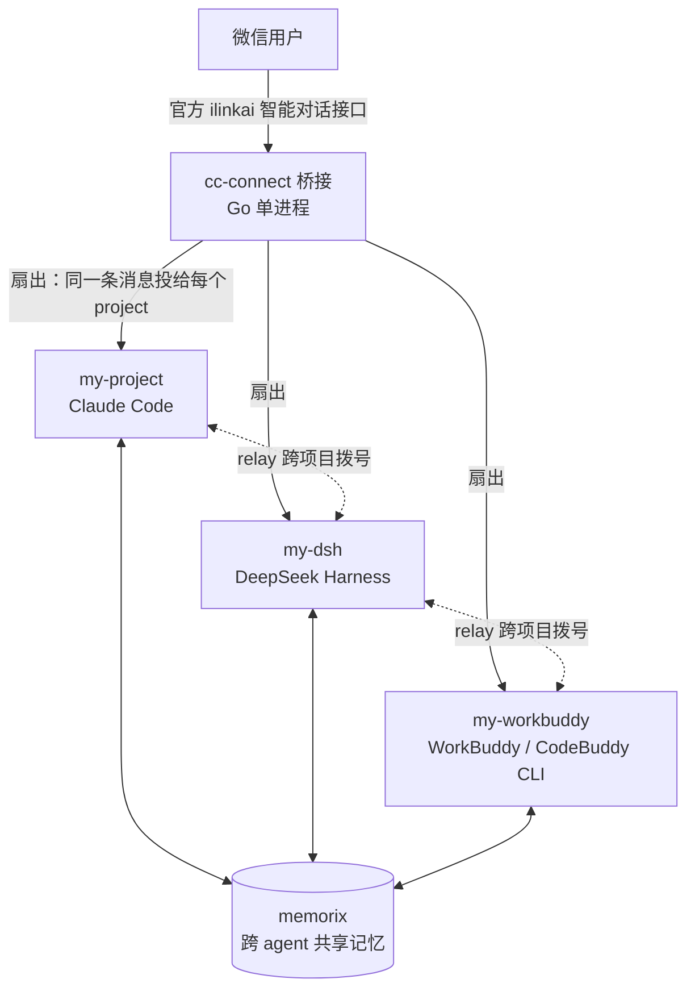

# cc-connect-multi-agent

把**多个不同的 AI agent** 接到**同一个微信入口**的完整实践记录 —— 含架构、配置、14 个探针脚本、以及一路踩过的坑。

> 这套东西跑在一台 Windows 11 笔记本上（Ryzen 7 6800H + RTX 3050 Ti）。目标很朴素：**不想为了跟不同 AI 说话而开不同的窗口**，就用微信当一个统一入口，背后挂三个 agent，各干各擅长的活。

---

## 架构



- **入口层**：微信（走腾讯官方 ilinkai 智能对话接口，非第三方协议，无封号风险）
- **桥接层**：`cc-connect` —— 负责收消息、拉起 agent、把回复发回去
- **agent 层**：Claude Code（原生支持）、DSH / WorkBuddy（都走标准 ACP 协议）
- **协作层**：`relay`（agent 之间互相拨号）+ `memorix`（共享记忆与留言板）

---

## 先说清楚：它做不到什么

这部分比「能做什么」更重要。下面每条都是**实测**结论，不是推测。

### 1. 消息是「扇出」，不是「路由」

一条微信消息会被**原样投给配置里的每一个 project**。日志表现为同一个 `msg_id` 出现 N 次 `message received`（N = project 数），随后 N 次 `turn complete`。

```
msg_id=7505310717695579528 → 3 次 message received → 3 次 turn complete
```

**cc-connect 没有「按内容 / 关键词 / @ 对象 选择投递给谁」的入站能力。**

### 2. 「不该我答」是靠 agent 自己判、不是桥接拦

`NO_REPLY` 这个字面量在 `cc-connect.exe` 里**搜不到** —— 它不是桥接的内置开关，而是**提示词约定**：agent 的规则文件（`CLAUDE.md` / `AGENTS.md`）要求它在「不该自己答」时整段只输出 `NO_REPLY`，桥接识别后把该次回复标记 `silent=true` 并不投递。

代价是：**其他 agent 依然会跑完一次完整 LLM 调用**，只是不占微信消息位。

### 3. `banned_words` 无法用于按 project 定向拦截（实测失败）

同一测试词分别写在 ① 项目级（`[[projects]]` 下、与 `name` 同级）② 平台级（`[projects.platforms.options]` 下）—— **两处都不生效**：消息照常进入全部 agent，三条回复全部投递（3 × `turn complete` 全部 `silent=false`）。

推断它是**全局**配置（写在 project 内被 TOML 库静默忽略，pelletier 不报未知字段）。而全局＝拦所有 project，做不到「只让某个 agent 收到」。

### 4. 微信私聊不传「@ 了谁」

会话键为 `weixin:dm:...` 时，`@dsh` 在桥接眼里**只是普通文本**，没有结构化 @ 数据。原生 @ 路由是**飞书侧**的能力（二进制里 `require_mention`、`<at id=%s></at>`、`receive_id_type` 等字段紧邻出现；微信侧无对应实现）。

微信平台只有 `allow_from`，它按**发送者**过滤，不是按 @ 对象过滤。

> **可用的变通**：把某个 project 的 `allow_from` 设成一个不存在的用户 ID，它就再也收不到你的消息了 —— 相当于一个「入站总开关」。而被关掉入场的 agent 依然能被 `relay` 叫醒干活（relay 走内部通道，不过微信平台）。适合「平时只跟某一个 agent 对话」的场景，不适合「按 @ 动态切换」。

### 5. `[[hooks]]` 是只读观察者

它能通过 `CC_HOOK_*` 环境变量拿到事件上下文，但**不能拦截或改写消息**。别指望用它做路由。

### 结论

想要真正的「@ 谁只有谁收到」，只能靠：

| 路线 | 做法 | 代价 |
|---|---|---|
| 独立 bot 身份 | 每个 agent 一个微信机器人 | 微信里多几个联系人 |
| 自建聊天入口 | 用 cc-connect 的 management API 定向投递（`POST /api/v1/projects/{name}/send`） | 要开发 |
| 单前台 + relay | 微信只挂一个 project 当前台，其余由它转发 | 延迟明显（relay 往返实测 46–51 秒） |

---

## 目录

| 路径 | 内容 |
|---|---|
| `docs/01-思考泄漏与共享记忆层-诊断修复报告.md` | agent 把思考过程发到微信的根因与修法 |
| `docs/02-memorix共聊0.2规约与成败点验证报告.md` | 「人机共聊」方案的可行性验证 |
| `docs/03-relay跨agent主动协作通道-实测报告.md` | relay（agent 互拨）的绑定机制、两个缺陷与补救 |
| `docs/04-cc-connect微信桥接运维手册.md` | 运维手册：路径、配置格式坑、重启规程、排障命令 |
| `docs/05-能力边界实测.md` | 上面「做不到什么」的完整证据链 |
| `config/config.example.toml` | 三 agent 接入的完整配置样例（已脱敏） |
| `scripts/` | 14 个探针/诊断脚本（ACP 握手、权限、会话读取、记忆层验证） |

---

## 快速开始

```bash
# 1. 装 cc-connect
npm i -g cc-connect

# 2. 拷贝配置并替换占位符
cp config/config.example.toml ~/.cc-connect/config.toml

# 3. 验证 TOML 语法（这一步能省掉大量排障时间）
python -c "import tomllib;tomllib.load(open(r'$HOME/.cc-connect/config.toml','rb'));print('OK')"

# 4. 启动
cc-connect daemon start
# 日志确认：config loaded → 每个 project 的 platform ready → cc-connect is running projects=N
```

**验证通道是否真的通了**（不依赖微信，直接走 ACP 协议）：

```bash
python scripts/acp_probe.py "@claude，1+1 是多少"     # DSH / ACP agent
python scripts/cbc_acp_probe.py                       # CodeBuddy / WorkBuddy 握手
```

---

## 踩坑清单

按「症状 → 根因 → 修法」整理，全部是本机实测。

| 症状 | 根因 | 修法 |
|---|---|---|
| 服务起不来，日志只有反复的 `acquired instance lock` | `admin_from` 被写成 TOML 表，而它必须是**字符串** | 改成 `admin_from = "xxx@im.wechat"`，放在 `[[projects]]` 表头下方 |
| agent 的思考过程被当成回复发到微信 | cc-connect 的 ACP 适配器不区分思考块与正文块，两者被拼成同一条回复 | 在 args 里挂 `scripts/acp-thought-filter.js` 丢弃 `agent_thought_chunk`；并设 `[display] thinking_messages=false` |
| 微信侧「完全没回」 | agent 发出权限请求后没人审批，回合永久挂起 | Claude Code 设 `mode="bypassPermissions"`；CLI 型 agent 设 `--permission-mode bypassPermissions` |
| `daemon stop` 打印成功但进程还在 | cc-connect 的已知行为 | stop 后必须手动 `Stop-Process -Force` 杀本体与后代，再 `daemon start` |
| 加 ACP agent 时报 `agent option "command" is required` | 字段名是 `command`，写成 `cmd` 无效 | 改回 `command` |
| 部分回复发送失败，报 `sendMessage ret=-2` | 多个 project 共用同一个微信 bot，`context_token` 相互挤掉 | 减少共用该 token 的 project 数，或给不同 project 配独立 bot |
| 某 agent 的规则文件明明改了却不生效 | resume 的旧会话不会重新加载 `CLAUDE.md` / `AGENTS.md` | 备份并移走 `sessions/*.json`，重启后新会话才吃到新规则 |
| 改完措辞模型依然不听 | 温和措辞对模型约束力不足 | 改成**协议级硬规则**（禁止作答、禁止调用工具、完整回复必须恰好 N 个字符） |

---

## 依赖与致谢

- [cc-connect](https://github.com/chenhg5/cc-connect) —— 消息平台 ↔ 本地 AI agent 桥接（本方案的底座）
- [memorix](https://github.com/AVIDS2/memorix) —— 跨 agent 本地优先共享记忆
- 微信通道走腾讯 `ilinkai.weixin.qq.com` 官方智能对话接口

---

## 说明

仓库内容为本机实测记录，含大量 Windows 绝对路径与进程排查细节，**已脱敏**（微信 open_id、bot token 均为占位符）。若要复现，请按 `config/config.example.toml` 中的注释逐项替换。
